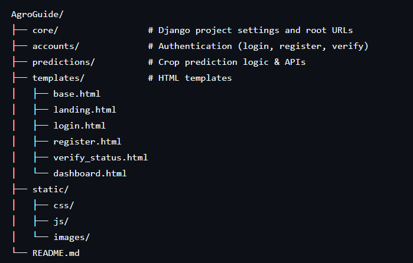

# AgroGuide 🌾  
AI-Powered Crop Recommendation System

AgroGuide is a web-based application that recommends the most suitable crops based on soil nutrients and climatic conditions using machine learning.

---

## Project Structure


## Frontend Status (Completed)

The following are already implemented and **should not be modified without discussion**:

### Pages
- Landing Page
- Login Page
- Register Page
- Email Verification Status Page (`verify_status.html`)
- Dashboard (Sliders, Charts, Results)

### JavaScript Logic
- `slider.js` – Handles sliders & input values
- `dashboard.js` – Form submission & results rendering
- `charts.js` – Chart.js visualizations

---

## Backend Responsibilities 🚀

Backend developers should focus ONLY on the following:

### 1. API Endpoint: Crop Prediction

**URL**
```
POST /api/predict/
```

**Expected JSON Request**
```json
{
  "nitrogen": 90,
  "phosphorus": 42,
  "potassium": 43,
  "temperature": 25.5,
  "humidity": 80,
  "rainfall": 200,
  "ph": 6.5
}
```

**Expected JSON Response**
```json
{
  "predictions": [
    { "name": "Rice", "score": 0.89 },
    { "name": "Wheat", "score": 0.76 },
    { "name": "Maize", "score": 0.68 }
  ],
  "explanation": "Rice is recommended due to high nitrogen and adequate rainfall.",
  "feature_importance": {
    "labels": ["Nitrogen", "Phosphorus", "Potassium", "Temperature", "Humidity", "Rainfall", "pH"],
    "values": [0.25, 0.18, 0.15, 0.14, 0.12, 0.10, 0.06]
  }
}
```

⚠️ **Important**
- `score` must be between `0 and 1`
- Feature importance values must sum to `1`

---

### 2. URL Names (DO NOT CHANGE)

These names are already used in templates:

| URL Name | Purpose |
|--------|--------|
| `landing` | Home page |
| `login` | Login page |
| `register` | Registration page |
| `dashboard` | User dashboard |
| `logout` | Logout |
| `verify_email` | Email verification |

Changing these will break templates.

---

### 3. Email Verification

- Verification page template: `verify_status.html`
- Context expected:
```python
{
  "success": True  # or False
}
```

---

### 4. Authentication
- Use Django auth system
- CSRF is already handled in frontend
- Login redirects to dashboard

---

### 5. Optional Enhancements
- Save prediction history per user
- Improve explanation text using ML insights
- Add confidence thresholds

---

## Setup Instructions

```bash
python -m venv venv
source venv/bin/activate  # Windows: venv\Scripts\activate
pip install -r requirements.txt
python manage.py migrate
python manage.py runserver
```

---

## Notes for Backend Team
- Frontend is stable
- JS expects strict response format
- Coordinate before changing URLs or templates

---

## Maintained By
AgroGuide Team 🌱
